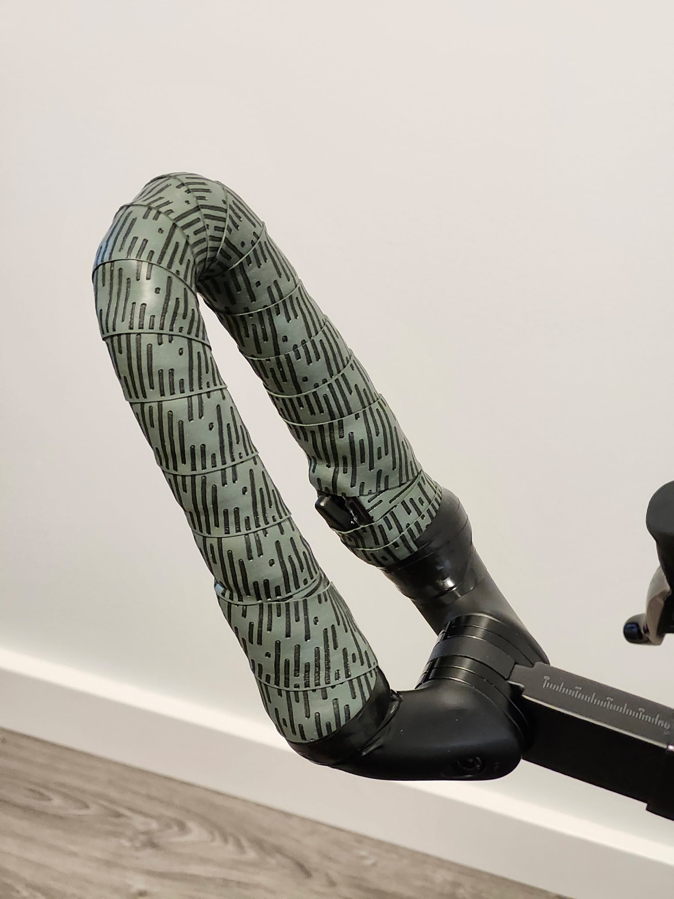

# Work in progress

---
# Handle Bar Extension

**Category:** Ergonomic Design | Bike Parts

## Overview

Handle Bar extensions for triathalon bike. Bars encourage a more aerodynamic form.

## Gallery

### 3D Model

[View the interactive 3D model](./images/HandleBarExtensionAssy.stl)

(Click the link above to view the model with rotation, zoom, and pan controls in GitHub's 3D viewer)

## Project Details

- **Date:** March 2026
- **Project Type:** Gift for Friend
- **Materials:**
  - Body: PETG plastic (3D printed)
- **Software:** FreeCAD
- **Manufacturing:** 3D printing

---

[← Back to Projects](../../README.md)

---

[← Back to Projects](../../README.md)
