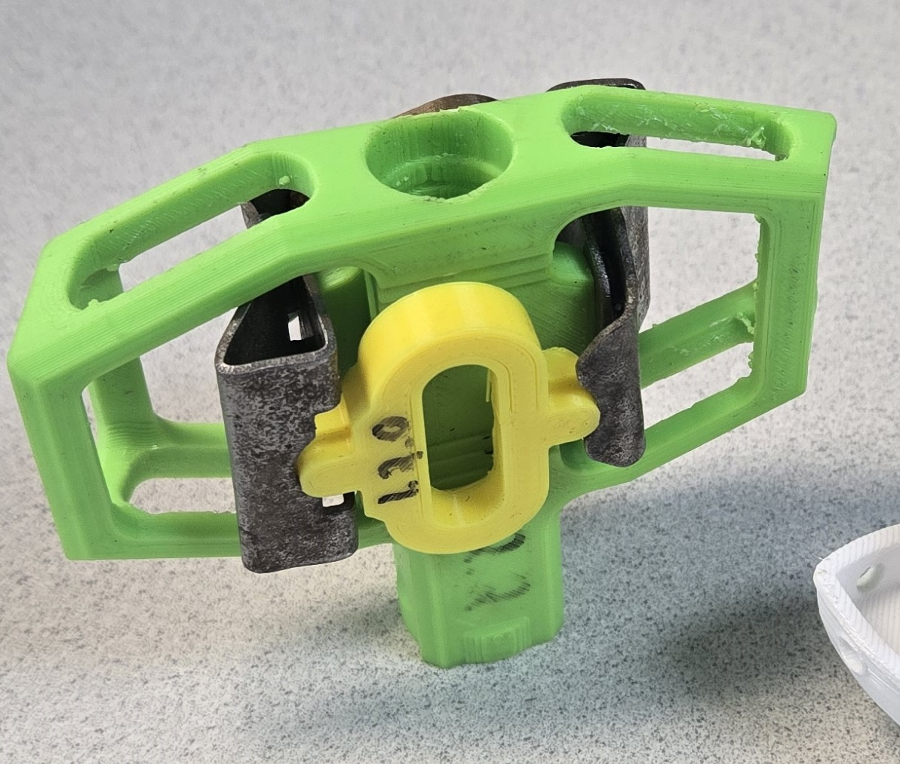

# Clipless Bike Pedal

**Category:** Mechanical Design | Capstone Project

## Overview

A custom-designed clipless bike pedal developed as part of the UBCO Engineering Capstone project in April 2019. The pedal body was 3D printed in ABS plastic, with precision-engineered spring steel clips cut using a water jet for optimal performance and durability.

## Gallery

## Project Details

- **Date:** April 2019
- **Project Type:** UBCO Engineering Capstone
- **Materials:**
  - Body: ABS plastic (3D printed)
  - Clips: Spring steel (water jet cut)
- **Software:** SOLIDWORKS
- **Manufacturing:** 3D printing + precision water jet cutting

## Key Features

- Custom clipless mechanism for improved foot retention
- Lightweight ABS plastic construction
- Spring steel clips engineered for durability and performance
- Professional prototyping and manufacturing process

---

[← Back to Projects](../../README.md)
