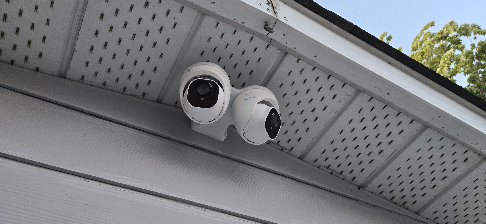

# Dual Camera Mount

**Category:** Practical Design | Home Security

## Overview

A custom designed mount to hold two turret security cameras. The mount is designed using FreeCAD an open source 3D modelling software. The mount was 3D printed using PETG plastic for its UV and water resistance.

## Gallery

### 3D Model

[View the interactive 3D model](./images/DualCameraMount0.3.stl)

(Click the link above to view the model with rotation, zoom, and pan controls in GitHub's 3D viewer)

## Project Details

- **Date:** March 2026
- **Project Type:** Personal Home Security
- **Materials:**
  - Body: PETG plastic (3D printed)
- **Software:** FreeCAD
- **Manufacturing:** 3D printing

---

[← Back to Projects](../../README.md)
